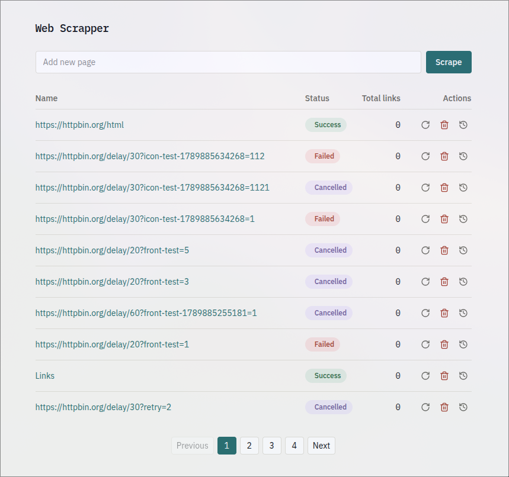
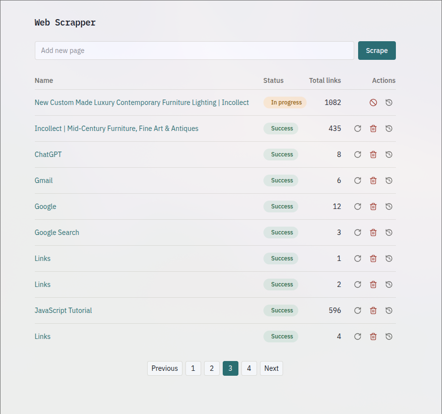
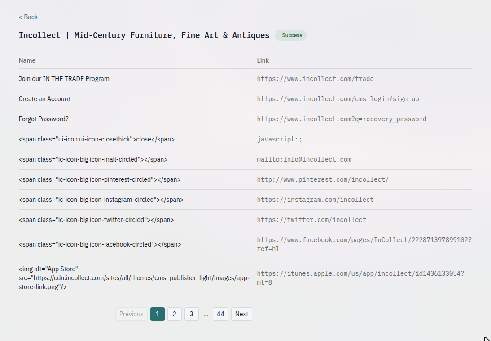
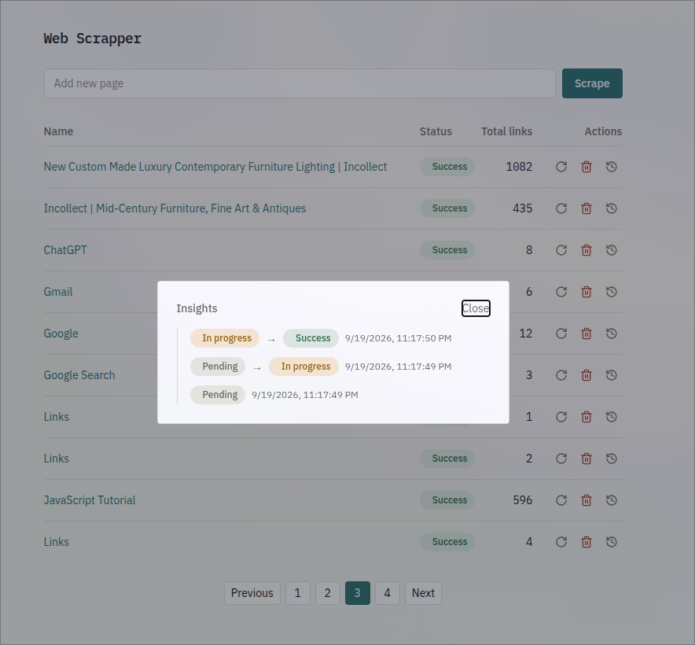
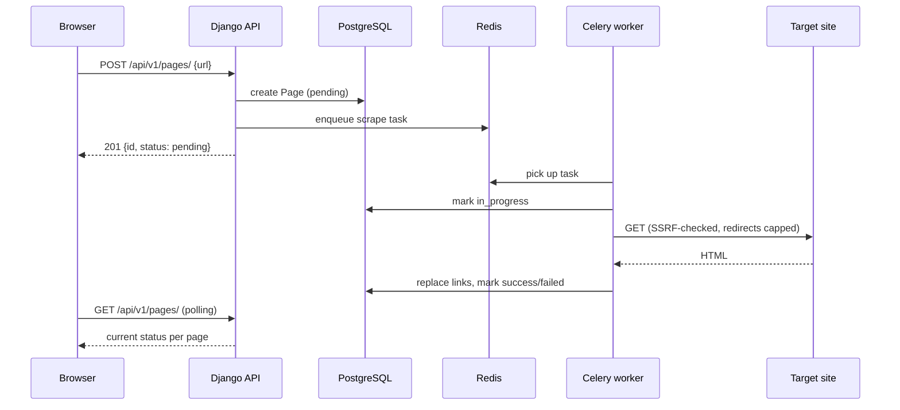
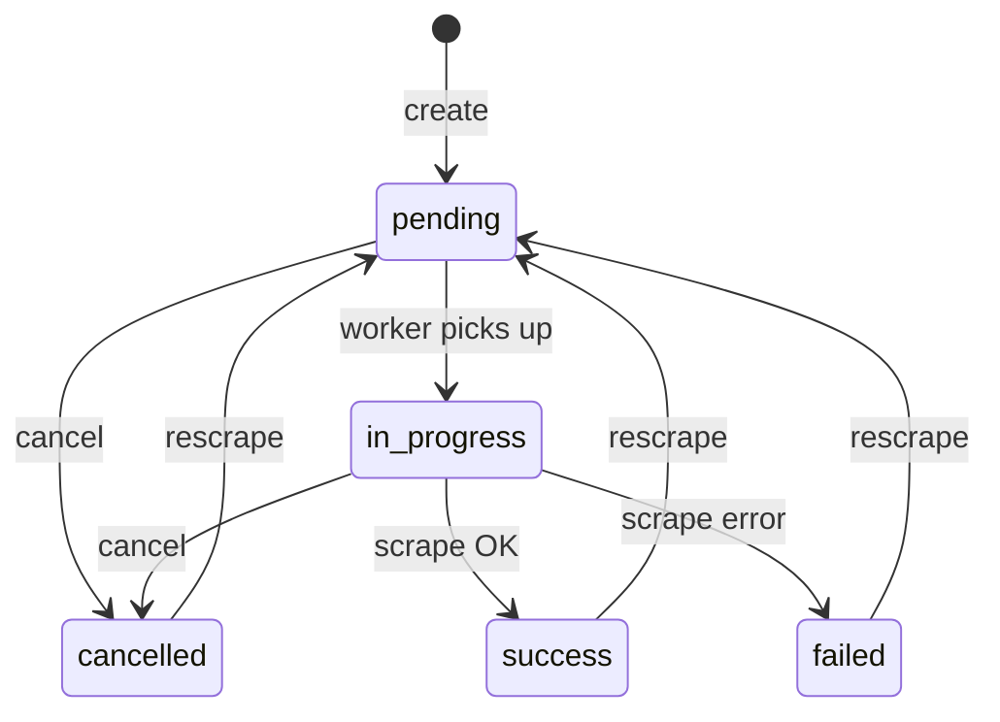

# Web Scrapper

A user adds a URL; the app scrapes every `<a>` tag on that page (href + the
link's visible name) and stores the result. Scraping runs asynchronously, so
the list shows pages currently in progress instead of blocking the request.
The frontend lists every page that's been scraped, with the number of links
found on each, its status, and lets you drill into a page to see its links
and its status history.

## Screenshots

| | |
|---|---|
|  List view: status badge and link count per page. |  A page mid-scrape shows as In progress; only Cancel is available while pending/in progress. |
|  Detail view: a page's links. Note the escaped `<span>`/`` markup in the Name column, since scraped HTML is rendered as text, never injected. |  Insights dialog: a page's full status history. |

## How it works

Submitting a URL only creates a row and returns immediately; the actual
fetch runs on a Celery worker, so a slow site can't block the request or
starve other submissions:



Every page moves through the same five states, and every arrow is a guarded
conditional update (only applied if the row is still in the expected
starting state) rather than a blind write, so a cancel request and a
worker finishing at the same instant can't overwrite each other:



A few other non-obvious decisions baked into the backend:
- **SSRF protection**: before every request (including each redirect hop),
  the target hostname is resolved and rejected if it points at a
  private/loopback/link-local/reserved IP. Redirects are capped at 3 hops.
- **Duplicate detection**: URLs are normalized (scheme/host lowercased,
  default port and trailing slash stripped, fragment dropped) and stored
  with a unique constraint, so submitting the same URL twice returns the
  existing page (`409`) instead of scraping it again. This includes the
  race where two near-simultaneous submissions both pass the initial
  duplicate check.
- **XSS safety**: a scraped link's inner HTML (`name_html`) is rendered as
  plain text on the frontend, never injected as markup, since it comes from
  an arbitrary third-party page.

## Tools used

**Backend**
- Python 3.12, Django 6.1, Django REST Framework
- django-environ (env-var configuration)
- psycopg (PostgreSQL driver)
- drf-spectacular (OpenAPI schema + Swagger UI/ReDoc)
- Celery + Redis (async scraping)
- requests, charset-normalizer, beautifulsoup4, lxml (fetching + parsing)
- ruff (lint + format)
- pytest, pytest-django, factory_boy, responses (testing)

**Frontend**
- Node 24, React 19 + TypeScript, Vite
- Tailwind CSS v4, react-router-dom, lucide-react (icons)
- @fontsource/ibm-plex-sans, @fontsource/ibm-plex-mono (self-hosted fonts)
- oxlint (lint)
- Vitest, React Testing Library, jsdom (testing)

**Infra**
- Docker + Docker Compose
- PostgreSQL 16, Redis 7

## Running the project

Everything runs with a single command from `infra/`:

```bash
cd infra
cp .env.example .env   # edit values if you want different Postgres credentials
docker compose up -d
```

This boots PostgreSQL, Redis, the Django API, the Celery worker, and the
frontend, running migrations on backend startup. No other manual steps
needed.

| Service    | URL                        |
|------------|----------------------------|
| Frontend   | http://localhost:5173      |
| Backend    | http://localhost:8000/api/v1/ |
| API docs   | http://localhost:8000/api/schema/swagger-ui/ (or `/redoc/`) |
| Postgres   | localhost:5433 (5432 avoided to dodge clashes with other local instances) |
| Redis      | localhost:6379             |

View logs for any service:

```bash
docker compose logs -f backend   # or worker, frontend, postgres, redis
```

Stop the stack:

```bash
docker compose down
```

### Running without Docker (local development)

**Backend** (needs a Postgres + Redis already running, e.g. via
`docker compose up -d postgres redis` from `infra/`):

```bash
cd backend
python3 -m venv .venv
source .venv/bin/activate
pip install -r requirements-dev.txt
cp .env.example .env   # needs a real SECRET_KEY and a DATABASE_URL matching your Postgres
python manage.py migrate
python manage.py runserver
```

Generate a `SECRET_KEY`:

```bash
python -c "from django.core.management.utils import get_random_secret_key; print(get_random_secret_key())"
```

In a second terminal, run the Celery worker (needed for scraping to actually
happen):

```bash
cd backend
source .venv/bin/activate
celery -A config worker -l info
```

**Frontend**:

```bash
cd frontend
npm install
npm run dev
```

## Testing

Full suite, either inside the running containers:

```bash
docker compose exec backend pytest
docker compose exec backend ruff check .
docker compose exec backend ruff format --check .
docker compose exec backend python manage.py spectacular --validate --fail-on-warn --file /dev/null
docker compose exec frontend npm test
docker compose exec frontend npm run lint
```

or locally, from each project's own environment:

```bash
# backend/ (with .venv active)
pytest
ruff check .
ruff format --check .
python manage.py spectacular --validate --fail-on-warn --file /dev/null

# frontend/
npm test
npm run lint
```
